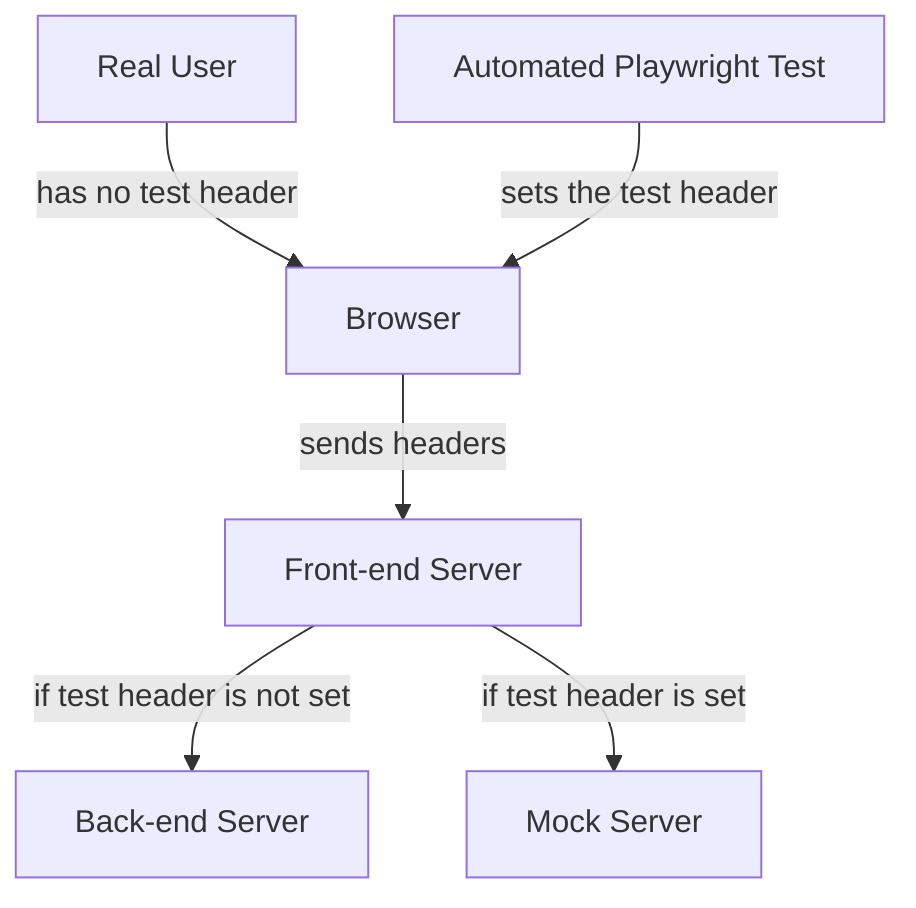

# Smeargle (React)

> Smeargle, the Painter Pokémon. Colored fluids ooze from their tails, which they use to mark their territory and to express themselves.

An eshop built with React. As this application is customer oriented, it has a strong focus on SSR and SEO.

## 📐 Architecture

### Full-stack framework

This app uses [Tanstack Start](https://tanstack.com/start/latest) as a full-stack framework to manage the Server-side Rendering and Backend for Frontend aspect of it. It is organized as follows:

- Tanstack Start specific code must be isolated from remaining code and can only be imported inside `src/app`.
- Tanstack Start code will not be unit tested. Integration / E2E tests will cover it. This means that this code should not have any business logic itself and should function only as a wrapper to augment the rest of the code with framework features.
- Server only code must be inside files suffixed with `.server.ts`. A custom plugin is used to prevent these files from being imported in the client.

### 🧪 Testing

This app has several kinds of tests:

#### General tests

- To run these tests, use `pnpm test`.
- Tests are inside the `src` folder and contain `.test.` in the file name.
- Test reports are inside the `coverage` folder.

This app uses [Vitest](https://vitest.dev/) for general testing purposes. These test specific pieces of code like functions or components.

#### Integration Tests

- To run these tests, use `pnpm test:integration`.
- Tests are inside the `tests/integration/src/tests` folder.
- Mock server is inside the `tests/integration/src/server` folder.
- Test reports are inside the `tests/report` folder.

This app uses [Playwright](https://playwright.dev/) for integration testing. These tests involve testing the whole app, mocking only it's boundaries. In this case it involves interacting with both the client-side and server-side of the app by simulating user interactions via a browser, and redirecting requests to a mock server.

To support this redirection, no special builds of the app are required. Instead the app's server contains a middleware that listens to the request's headers. If a test header is present, and the `TEST_API_BASE_URL`environment variable is defined, all requests done by the server will be redirected and the test header will be added to the requests.

The value of the test header is a comma separated string that represents a list of scenario ids. These scenario ids are used by the mock server to modify the response data. This way, multiple requests can be performed by multiple tests, in parallel, without causing conflicts.

#### Visual Regression tests

TODO: Once tests are configured

#### End-to-end tests

TODO: Once tests are configured

## 🤡 Gotchas

### Testing with server-side rendering (SSR) frameworks

To me, one of the strongest indicators of the quality of a library or framework is how well it integrates with testing tools and how easy it is to create quality tests for it.
Unfortunately, much of today’s JavaScript ecosystem either treats testing as a second-class citizen, or ignores it entirely, forcing developers to rely on community-maintained tools and documentation just to test their code.

Server-side rendering frameworks such as **Next.js** and **TanStack Start** are among the most notable offenders. Not only do they not provide testing utils or adapters, but, since SSR features typically require special compilation steps, it becomes increasingly difficult, if not impossible, to write simple tests without either running the entire application or extensively mocking these framework exports.

When the application must be run in order to test it, tests cease to be simple unit or integration tests and instead begin to resemble system tests. Conversely, the more dependencies are mocked, the less the tests reflect real application behavior. This also increases reliance on implementation details, leading to flaky tests that tend to break during refactors.

To work around these issues, most application code should be isolated from SSR-specific features. This allows the majority of the codebase to be tested using standard approaches, while also encouraging better separation of concerns.
For code that depends on SSR features, system tests are needed. In these cases, tools such as **Playwright** and **MSW** can be used to isolate the browser and server environments from external dependencies. This way, client side and server side functionality can be tested, and the only mocks needed are for external network requests.
